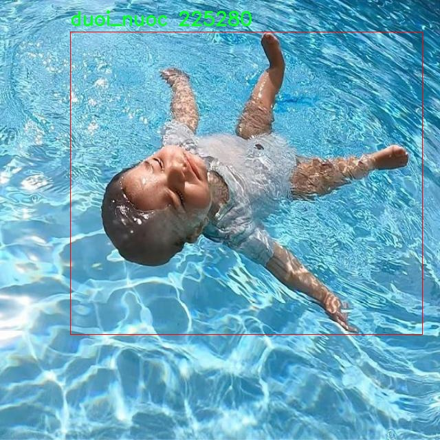

# 溺水人员检测检测系统源码分享
 # [一条龙教学YOLOV8标注好的数据集一键训练_70+全套改进创新点发刊_Web前端展示]

### 1.研究背景与意义

项目参考[AAAI Association for the Advancement of Artificial Intelligence](https://gitee.com/qunmasj/projects)

项目来源[AACV Association for the Advancement of Computer Vision](https://kdocs.cn/l/cszuIiCKVNis)

研究背景与意义

随着全球水域活动的普及，溺水事故的发生频率逐年上升，尤其是在夏季游泳高峰期，溺水事件更是屡见不鲜。根据世界卫生组织的统计，溺水已成为全球范围内导致儿童和青少年死亡的主要原因之一。因此，及时有效地检测和救助溺水人员，已成为保障公共安全的重要课题。传统的溺水监测手段主要依赖于人工巡逻和监控摄像头的监视，然而这些方法往往存在反应速度慢、监测范围有限以及人力资源消耗大等问题。为了解决这些不足，基于深度学习的目标检测技术逐渐成为研究的热点。

YOLO（You Only Look Once）系列模型因其高效的实时检测能力而受到广泛关注。YOLOv8作为该系列的最新版本，进一步提升了检测精度和速度，尤其适合在复杂环境中进行实时目标检测。通过对YOLOv8模型的改进，结合特定的溺水场景，可以构建出一个高效的溺水人员检测系统。该系统不仅能够在游泳池、海滩等场所实时监测溺水情况，还能通过对不同类别的目标进行识别（如“duoi_nuoc”和“Swimming”），实现对溺水人员的精准定位和快速响应。

在本研究中，我们使用的数据集包含9300张图像，涵盖了两个主要类别：溺水状态的人员（duoi_nuoc）和正常游泳状态的人员（Swimming）。这一数据集的构建为模型的训练和验证提供了丰富的样本，能够有效提高模型在实际应用中的鲁棒性和准确性。通过对这些图像进行标注和分类，我们可以使模型学习到溺水人员与正常游泳人员之间的细微差别，从而在实际应用中实现高效的溺水检测。

本研究的意义不仅在于提升溺水检测的技术水平，更在于为公共安全提供一种新的解决方案。通过引入改进的YOLOv8模型，我们期望能够显著提高溺水事件的响应速度，减少因溺水造成的生命损失。此外，该系统的成功应用也为其他水域安全监测提供了借鉴，推动了智能监控技术在公共安全领域的进一步发展。

综上所述，基于改进YOLOv8的溺水人员检测系统的研究，不仅具有重要的理论价值，还有着广泛的实际应用前景。通过这一研究，我们希望能够为水域安全监测提供更为高效、智能的解决方案，助力于减少溺水事故的发生，保护人们的生命安全。

### 2.图片演示


##### 注意：由于此博客编辑较早，上面“2.图片演示”和“3.视频演示”展示的系统图片或者视频可能为老版本，新版本在老版本的基础上升级如下：（实际效果以升级的新版本为准）

  （1）适配了YOLOV8的“目标检测”模型和“实例分割”模型，通过加载相应的权重（.pt）文件即可自适应加载模型。

  （2）支持“图片识别”、“视频识别”、“摄像头实时识别”三种识别模式。

  （3）支持“图片识别”、“视频识别”、“摄像头实时识别”三种识别结果保存导出，解决手动导出（容易卡顿出现爆内存）存在的问题，识别完自动保存结果并导出到tempDir中。

  （4）支持Web前端系统中的标题、背景图等自定义修改，后面提供修改教程。

  另外本项目提供训练的数据集和训练教程,暂不提供权重文件（best.pt）,需要您按照教程进行训练后实现图片演示和Web前端界面演示的效果。

### 3.视频演示

[3.1 视频演示](https://www.bilibili.com/video/BV1tzxeevEx4/)

### 4.数据集信息展示

##### 4.1 本项目数据集详细数据（类别数＆类别名）

nc: 6
names: ['Out of Water', 'Swimming', 'duoi_nuoc', 'out of water', 'person-out-of-water', 'swimming']


##### 4.2 本项目数据集信息介绍

数据集信息展示

在本研究中，我们采用了名为“abc”的数据集，以训练和改进YOLOv8模型，旨在提升溺水人员检测系统的准确性和可靠性。该数据集专门设计用于处理与水域相关的场景，涵盖了多种可能的人员状态，以便于模型在实际应用中能够更好地识别和分类不同的溺水情况。数据集的类别数量为六个，具体类别包括“Out of Water”、“Swimming”、“duoi_nuoc”、“out of water”、“person-out-of-water”和“swimming”。这些类别不仅反映了人员在水中和水外的不同状态，还考虑到了多样化的表述方式，以增强模型的泛化能力。

“Out of Water”类别主要用于标识那些已经成功脱离水域的个体，这对于溺水救援和事后分析至关重要。通过准确识别这一状态，系统能够帮助救援人员快速判断现场情况，从而采取适当的措施。而“Swimming”类别则用于标识在水中游泳的人员，这一状态在溺水检测中尤为重要，因为在某些情况下，游泳者可能会面临突发的危险。

值得注意的是，数据集中还包含了“duoi_nuoc”这一类别，专门用于标识那些在水下的人员。这一类别的设定旨在帮助模型识别潜在的溺水者，尤其是在水面上无法直接观察到的情况下。与之相对的，“out of water”和“person-out-of-water”类别则进一步细化了对脱水状态的识别，确保模型能够区分不同的脱水状态，从而提高检测的准确性。

此外，“swimming”类别的存在则强调了在水中活动的人员与溺水者之间的区别。这一细分不仅有助于减少误报率，还能提高模型在复杂场景下的识别能力。例如，在游泳池或海滩等场所，可能会有多名游泳者同时存在，系统需要能够准确区分哪些人处于安全状态，哪些人可能处于危险之中。

为了确保数据集的有效性和多样性，我们在收集数据时考虑了不同的环境条件、光照变化以及水域类型等因素。这些多样化的场景能够帮助模型在训练过程中学习到更为丰富的特征，从而在实际应用中更好地应对各种复杂情况。此外，数据集中的样本均经过精心标注，确保每一张图像都能准确反映出人员的真实状态，为模型的训练提供了坚实的基础。

综上所述，数据集“abc”不仅在类别设计上考虑到了溺水检测的多样性和复杂性，还在数据收集和标注过程中注重了质量和多样性。这些因素共同为改进YOLOv8的溺水人员检测系统奠定了坚实的基础，期待通过本研究的深入，能够为实际的溺水救援工作提供更为有效的技术支持。





### 5.全套项目环境部署视频教程（零基础手把手教学）

[5.1 环境部署教程链接（零基础手把手教学）](https://www.ixigua.com/7404473917358506534?logTag=c807d0cbc21c0ef59de5)


[5.2 安装Python虚拟环境创建和依赖库安装视频教程链接（零基础手把手教学）](https://www.ixigua.com/7404474678003106304?logTag=1f1041108cd1f708b01a)

### 6.手把手YOLOV8训练视频教程（零基础小白有手就能学会）

[6.1 手把手YOLOV8训练视频教程（零基础小白有手就能学会）](https://www.ixigua.com/7404477157818401292?logTag=d31a2dfd1983c9668658)

### 7.70+种全套YOLOV8创新点代码加载调参视频教程（一键加载写好的改进模型的配置文件）

[7.1 70+种全套YOLOV8创新点代码加载调参视频教程（一键加载写好的改进模型的配置文件）](https://www.ixigua.com/7404478314661806627?logTag=29066f8288e3f4eea3a4)

### 8.70+种全套YOLOV8创新点原理讲解（非科班也可以轻松写刊发刊，V10版本正在科研待更新）

由于篇幅限制，每个创新点的具体原理讲解就不一一展开，具体见下列网址中的创新点对应子项目的技术原理博客网址【Blog】：


[8.1 70+种全套YOLOV8创新点原理讲解链接](https://gitee.com/qunmasj/good)

### 9.系统功能展示（检测对象为举例，实际内容以本项目数据集为准）

图9.1.系统支持检测结果表格显示

  图9.2.系统支持置信度和IOU阈值手动调节

  图9.3.系统支持自定义加载权重文件best.pt(需要你通过步骤5中训练获得)

  图9.4.系统支持摄像头实时识别

  图9.5.系统支持图片识别

  图9.6.系统支持视频识别

  图9.7.系统支持识别结果文件自动保存

  图9.8.系统支持Excel导出检测结果数据


### 10.原始YOLOV8算法原理

原始YOLOv8算法原理

YOLOv8作为YOLO系列的最新迭代，继续在目标检测领域发挥着重要作用。其设计理念是将目标检测任务转化为一个回归问题，通过一个单一的神经网络模型同时预测目标的位置和类别。这一方法的核心在于其高效性和实时性，使得YOLOv8在处理复杂场景时能够快速而准确地识别目标。YOLOv8的网络结构由三大部分组成：Backbone、Neck和Head，每一部分都在前一代YOLO模型的基础上进行了优化和改进。

在Backbone部分，YOLOv8采用了一系列卷积和反卷积层来提取特征，同时引入了残差连接和瓶颈结构，以减小网络的大小并提高性能。具体而言，YOLOv8使用了C2模块作为基本构成单元，这种模块的设计灵感来源于YOLOv5的C3模块，并结合了ELAN思想。C2f模块的引入，使得特征提取过程更加高效，能够更好地捕捉图像中的细节信息。通过对特征图进行逐层处理，YOLOv8能够在保持较低计算复杂度的同时，获得丰富的特征表示。

Neck部分则采用了多尺度特征融合技术，旨在将来自Backbone不同阶段的特征图进行有效融合，以便更好地捕捉不同尺度目标的信息。YOLOv8引入了PAN-FPN结构，这一结构能够在自下而上的过程中，将高层特征与中层和浅层特征进行深度融合，确保不同层次的特征信息能够充分利用。通过这种方式，YOLOv8在处理多尺度目标时表现出色，能够有效提高目标检测的性能和鲁棒性。

在Head部分，YOLOv8的设计采用了解耦头的结构，取代了以往的耦合头。这一创新使得分类和回归任务能够独立进行，从而使得每个任务更加专注，解决了复杂场景下定位不准及分类错误的问题。具体来说，YOLOv8使用了Anchor-free的目标检测方法，这种方法不再依赖于预先定义的锚点框，而是通过回归的方式直接预测目标的位置和大小。这一变化显著简化了模型的设计，减少了对锚点框选择和调整的复杂性，使得模型在处理不同尺度和形状的目标时更加灵活。

YOLOv8还在损失函数的设计上进行了改进，采用了VFLLoss作为分类损失，DFLLoss与CIoULoss的组合用于回归损失。这种损失函数的设计考虑到了样本不平衡的问题，尤其是在处理小目标时，能够有效提高网络的学习效率。此外，YOLOv8的样本匹配策略也由静态匹配改为Task-Aligned的Assigner匹配方式，进一步提升了模型的训练效果。

在数据预处理方面，YOLOv8采用了与YOLOv5相似的策略，包括马赛克增强、混合增强、空间扰动和颜色扰动等多种数据增强手段。这些技术的应用使得模型在训练过程中能够更好地适应各种复杂场景，提高了检测的准确性和鲁棒性。

综上所述，YOLOv8通过对Backbone、Neck和Head的优化，结合了多种先进的技术，形成了一种高效、灵活且准确的目标检测算法。其在训练时间和检测精度上的提升，使得YOLOv8不仅适用于传统的目标检测任务，也为实时检测提供了强有力的支持。随着YOLOv8的推出，目标检测领域的研究和应用将迎来新的机遇和挑战。


### 11.项目核心源码讲解（再也不用担心看不懂代码逻辑）

#### 11.1 ui.py

以下是对代码的核心部分进行保留和详细注释的版本：

```python
import sys
import subprocess

def run_script(script_path):
    """
    使用当前 Python 环境运行指定的脚本。

    Args:
        script_path (str): 要运行的脚本路径

    Returns:
        None
    """
    # 获取当前 Python 解释器的路径
    python_path = sys.executable

    # 构建运行命令，使用 streamlit 运行指定的脚本
    command = f'"{python_path}" -m streamlit run "{script_path}"'

    # 执行命令并等待其完成
    result = subprocess.run(command, shell=True)
    
    # 检查命令执行结果，如果返回码不为0，表示出错
    if result.returncode != 0:
        print("脚本运行出错。")

# 主程序入口
if __name__ == "__main__":
    # 指定要运行的脚本路径
    script_path = "web.py"  # 假设脚本在当前目录下

    # 调用函数运行脚本
    run_script(script_path)
```

### 代码核心部分分析：

1. **导入模块**：
   - `sys`：用于获取当前 Python 解释器的路径。
   - `subprocess`：用于执行外部命令。

2. **`run_script` 函数**：
   - 接受一个参数 `script_path`，表示要运行的 Python 脚本的路径。
   - 使用 `sys.executable` 获取当前 Python 解释器的路径。
   - 构建一个命令字符串，用于调用 `streamlit` 运行指定的脚本。
   - 使用 `subprocess.run` 执行命令，并通过 `shell=True` 允许在 shell 中执行。
   - 检查命令的返回码，如果不为0，表示执行过程中出现错误，打印错误信息。

3. **主程序入口**：
   - 在 `if __name__ == "__main__":` 块中，指定要运行的脚本路径（这里假设为 `web.py`）。
   - 调用 `run_script` 函数来执行指定的脚本。

### 总结：
这段代码的核心功能是通过当前 Python 环境来运行一个指定的 Python 脚本，并且能够处理运行过程中可能出现的错误。

这个程序文件 `ui.py` 的主要功能是通过当前的 Python 环境来运行一个指定的脚本，具体是一个名为 `web.py` 的文件。程序的实现过程可以分为几个部分。

首先，文件导入了一些必要的模块，包括 `sys`、`os` 和 `subprocess`。`sys` 模块用于访问与 Python 解释器紧密相关的变量和函数，`os` 模块提供了与操作系统交互的功能，而 `subprocess` 模块则用于创建新进程、连接到它们的输入/输出/错误管道，并获取它们的返回码。

接下来，程序定义了一个名为 `run_script` 的函数，该函数接受一个参数 `script_path`，表示要运行的脚本的路径。在函数内部，首先获取当前 Python 解释器的路径，使用 `sys.executable` 来实现。然后，构建一个命令字符串，这个命令将使用当前的 Python 解释器来运行 `streamlit`，并指定要运行的脚本路径。

构建好命令后，程序使用 `subprocess.run` 方法来执行这个命令。`shell=True` 参数表示命令将在一个新的 shell 中执行。执行后，程序检查返回的结果码，如果不为零，说明脚本运行过程中出现了错误，此时会打印出“脚本运行出错”的提示信息。

最后，在文件的主程序部分，使用 `if __name__ == "__main__":` 来确保只有在直接运行该文件时才会执行以下代码。这里，程序指定了要运行的脚本路径，调用 `abs_path` 函数获取 `web.py` 的绝对路径，然后调用 `run_script` 函数来执行这个脚本。

总的来说，这个文件的作用是为一个 Streamlit 应用提供一个启动器，通过指定的脚本路径来运行该应用，方便用户在当前的 Python 环境中启动和测试 Web 应用。

#### 11.2 code\ultralytics\solutions\heatmap.py

以下是代码中最核心的部分，并附上详细的中文注释：

```python
import cv2
import numpy as np
from collections import defaultdict
from shapely.geometry import LineString, Point, Polygon

class Heatmap:
    """用于实时视频流中绘制热图的类，基于物体的轨迹。"""

    def __init__(self):
        """初始化热图类，设置默认的可视化、图像和跟踪参数。"""
        # 可视化信息
        self.annotator = None  # 注释器，用于绘制标注
        self.view_img = False  # 是否显示图像
        self.shape = "circle"  # 热图形状，默认为圆形

        # 图像信息
        self.imw = None  # 图像宽度
        self.imh = None  # 图像高度
        self.im0 = None  # 原始图像
        self.view_in_counts = True  # 是否显示进入计数
        self.view_out_counts = True  # 是否显示离开计数

        # 热图相关参数
        self.colormap = None  # 热图颜色映射
        self.heatmap = None  # 热图数组
        self.heatmap_alpha = 0.5  # 热图透明度

        # 预测/跟踪信息
        self.boxes = None  # 物体边界框
        self.track_ids = None  # 物体跟踪ID
        self.clss = None  # 物体类别
        self.track_history = defaultdict(list)  # 物体轨迹历史

        # 区域和线的信息
        self.count_reg_pts = None  # 计数区域的点
        self.counting_region = None  # 计数区域
        self.line_dist_thresh = 15  # 线计数的距离阈值
        self.region_thickness = 5  # 区域厚度
        self.region_color = (255, 0, 255)  # 区域颜色

        # 物体计数信息
        self.in_counts = 0  # 进入计数
        self.out_counts = 0  # 离开计数
        self.counting_list = []  # 计数列表
        self.count_txt_thickness = 0  # 计数文本厚度
        self.count_txt_color = (0, 0, 0)  # 计数文本颜色
        self.count_color = (255, 255, 255)  # 计数背景颜色

        # 衰减因子
        self.decay_factor = 0.99  # 热图衰减因子

    def set_args(self, imw, imh, colormap=cv2.COLORMAP_JET, heatmap_alpha=0.5, view_img=False,
                 view_in_counts=True, view_out_counts=True, count_reg_pts=None,
                 count_txt_thickness=2, count_txt_color=(0, 0, 0), count_color=(255, 255, 255),
                 count_reg_color=(255, 0, 255), region_thickness=5, line_dist_thresh=15,
                 decay_factor=0.99, shape="circle"):
        """
        配置热图的颜色映射、宽度、高度和显示参数。
        """
        self.imw = imw  # 设置图像宽度
        self.imh = imh  # 设置图像高度
        self.heatmap_alpha = heatmap_alpha  # 设置热图透明度
        self.view_img = view_img  # 设置是否显示图像
        self.view_in_counts = view_in_counts  # 设置是否显示进入计数
        self.view_out_counts = view_out_counts  # 设置是否显示离开计数
        self.colormap = colormap  # 设置热图颜色映射

        # 设置计数区域
        if count_reg_pts is not None:
            if len(count_reg_pts) == 2:  # 线计数
                self.count_reg_pts = count_reg_pts
                self.counting_region = LineString(count_reg_pts)
            elif len(count_reg_pts) == 4:  # 区域计数
                self.count_reg_pts = count_reg_pts
                self.counting_region = Polygon(self.count_reg_pts)
            else:
                print("区域或线点无效，仅支持2或4个点")
                self.counting_region = Polygon([(20, 400), (1260, 400)])  # 默认线

        # 初始化热图
        self.heatmap = np.zeros((int(self.imh), int(self.imw)), dtype=np.float32)

        # 设置其他参数
        self.count_txt_thickness = count_txt_thickness
        self.count_txt_color = count_txt_color
        self.count_color = count_color
        self.region_color = count_reg_color
        self.region_thickness = region_thickness
        self.decay_factor = decay_factor
        self.line_dist_thresh = line_dist_thresh
        self.shape = shape

    def extract_results(self, tracks):
        """
        从提供的数据中提取结果。
        """
        self.boxes = tracks[0].boxes.xyxy.cpu()  # 提取边界框
        self.clss = tracks[0].boxes.cls.cpu().tolist()  # 提取类别
        self.track_ids = tracks[0].boxes.id.int().cpu().tolist()  # 提取跟踪ID

    def generate_heatmap(self, im0, tracks):
        """
        根据跟踪数据生成热图。
        """
        self.im0 = im0  # 设置当前图像
        if tracks[0].boxes.id is None:  # 如果没有跟踪ID
            return
        self.heatmap *= self.decay_factor  # 应用衰减因子
        self.extract_results(tracks)  # 提取跟踪结果

        # 绘制计数区域
        if self.count_reg_pts is not None:
            for box, track_id in zip(self.boxes, self.track_ids):
                # 根据形状绘制热图
                if self.shape == "circle":
                    center = (int((box[0] + box[2]) // 2), int((box[1] + box[3]) // 2))
                    radius = min(int(box[2]) - int(box[0]), int(box[3]) - int(box[1])) // 2
                    y, x = np.ogrid[0:self.heatmap.shape[0], 0:self.heatmap.shape[1]]
                    mask = (x - center[0]) ** 2 + (y - center[1]) ** 2 <= radius**2
                    self.heatmap[int(box[1]):int(box[3]), int(box[0]):int(box[2])] += (
                        2 * mask[int(box[1]):int(box[3]), int(box[0]):int(box[2])]
                    )
                else:
                    self.heatmap[int(box[1]):int(box[3]), int(box[0]):int(box[2])] += 2

                # 计数逻辑
                track_line = self.track_history[track_id]
                track_line.append((float((box[0] + box[2]) / 2), float((box[1] + box[3]) / 2)))
                if len(track_line) > 30:
                    track_line.pop(0)

                # 物体计数
                if len(self.count_reg_pts) == 4:  # 区域计数
                    if self.counting_region.contains(Point(track_line[-1])) and track_id not in self.counting_list:
                        self.counting_list.append(track_id)
                        if box[0] < self.counting_region.centroid.x:
                            self.out_counts += 1
                        else:
                            self.in_counts += 1
                elif len(self.count_reg_pts) == 2:  # 线计数
                    distance = Point(track_line[-1]).distance(self.counting_region)
                    if distance < self.line_dist_thresh and track_id not in self.counting_list:
                        self.counting_list.append(track_id)
                        if box[0] < self.counting_region.centroid.x:
                            self.out_counts += 1
                        else:
                            self.in_counts += 1

        # 归一化热图并与原始图像结合
        heatmap_normalized = cv2.normalize(self.heatmap, None, 0, 255, cv2.NORM_MINMAX)
        heatmap_colored = cv2.applyColorMap(heatmap_normalized.astype(np.uint8), self.colormap)
        self.im0 = cv2.addWeighted(self.im0, 1 - self.heatmap_alpha, heatmap_colored, self.heatmap_alpha, 0)

        return self.im0  # 返回处理后的图像

    def display_frames(self):
        """显示图像帧。"""
        cv2.imshow("Ultralytics Heatmap", self.im0)
        if cv2.waitKey(1) & 0xFF == ord("q"):
            return

if __name__ == "__main__":
    Heatmap()  # 创建Heatmap类的实例
```

### 代码核心部分说明：
1. **类定义**：`Heatmap`类用于处理视频流中的热图生成和物体计数。
2. **初始化方法**：设置各种参数，包括图像尺寸、热图透明度、计数区域等。
3. **参数设置方法**：`set_args`方法用于配置热图的显示参数和计数区域。
4. **结果提取方法**：`extract_results`从跟踪数据中提取边界框、类别和跟踪ID。
5. **热图生成方法**：`generate_heatmap`根据跟踪数据生成热图，并更新计数信息。
6. **显示方法**：`display_frames`用于显示处理后的图像帧。

以上代码和注释为核心功能提供了清晰的结构和说明，便于理解热图生成和物体计数的实现过程。

这个程序文件定义了一个名为 `Heatmap` 的类，用于在实时视频流中基于目标的轨迹绘制热图。程序使用了 OpenCV 和 NumPy 库，并依赖于 `shapely` 库来处理几何形状。首先，程序通过 `check_requirements` 函数检查所需的库是否安装。

在 `Heatmap` 类的构造函数中，初始化了一些属性，包括可视化信息、图像信息、热图的颜色映射和热图数组、目标跟踪信息、计数区域和线的信息、对象计数信息以及衰减因子等。这些属性为后续的热图生成和目标计数提供了基础。

`set_args` 方法用于配置热图的参数，包括图像的宽度和高度、热图的颜色映射、透明度、是否显示图像、计数区域的点、文本的颜色和厚度等。该方法还根据传入的计数区域点数（2或4个点）来初始化计数区域，支持线计数和区域计数。

`extract_results` 方法从跟踪数据中提取目标的边界框、类别和跟踪 ID，并将这些信息存储在类的属性中。

`generate_heatmap` 方法是核心功能，它生成热图并根据跟踪数据更新热图。首先，它会根据衰减因子更新热图，然后提取跟踪结果。接着，如果设置了计数区域，则会绘制该区域，并根据目标的边界框更新热图。在更新热图的过程中，会根据目标的中心点和形状（圆形或矩形）来计算热图的值，并根据目标是否进入或离开计数区域来更新计数。

最后，热图会被归一化并应用颜色映射，然后与原始图像合成，显示在视频流中。如果用户选择显示计数信息，程序会在图像上标注进入和离开的计数。

`display_frames` 方法用于显示当前帧，允许用户通过按下“q”键退出显示。

在文件的最后部分，如果该文件作为主程序运行，则会实例化 `Heatmap` 类。这个类的设计使得它可以方便地集成到更大的目标检测和跟踪系统中，提供实时的热图和计数功能。

#### 11.3 70+种YOLOv8算法改进源码大全和调试加载训练教程（非必要）\ultralytics\nn\extra_modules\kernel_warehouse.py

以下是代码中最核心的部分，并附上详细的中文注释：

```python
import torch
import torch.nn as nn
import torch.nn.functional as F

class Attention(nn.Module):
    def __init__(self, in_planes, reduction, num_static_cell, num_local_mixture, norm_layer=nn.BatchNorm1d,
                 cell_num_ratio=1.0, nonlocal_basis_ratio=1.0, start_cell_idx=None):
        super(Attention, self).__init__()
        # 计算隐藏层的通道数
        hidden_planes = max(int(in_planes * reduction), 16)
        self.kw_planes_per_mixture = num_static_cell + 1  # 每个混合的关键字平面数
        self.num_local_mixture = num_local_mixture  # 本地混合数
        self.kw_planes = self.kw_planes_per_mixture * num_local_mixture  # 总的关键字平面数

        # 计算本地和非本地单元的数量
        self.num_local_cell = int(cell_num_ratio * num_local_mixture)
        self.num_nonlocal_cell = num_static_cell - self.num_local_cell
        self.start_cell_idx = start_cell_idx

        # 定义层
        self.avgpool = nn.AdaptiveAvgPool1d(1)  # 自适应平均池化
        self.fc1 = nn.Linear(in_planes, hidden_planes, bias=(norm_layer is not nn.BatchNorm1d))  # 线性层
        self.norm1 = norm_layer(hidden_planes)  # 归一化层
        self.act1 = nn.ReLU(inplace=True)  # 激活函数

        # 根据非本地基础比例选择映射方式
        if nonlocal_basis_ratio >= 1.0:
            self.map_to_cell = nn.Identity()  # 直接映射
            self.fc2 = nn.Linear(hidden_planes, self.kw_planes, bias=True)  # 线性层
        else:
            self.map_to_cell = self.map_to_cell_basis  # 使用基础映射
            self.num_basis = max(int(self.num_nonlocal_cell * nonlocal_basis_ratio), 16)  # 基础数量
            self.fc2 = nn.Linear(hidden_planes, (self.num_local_cell + self.num_basis + 1) * num_local_mixture, bias=False)
            self.fc3 = nn.Linear(self.num_basis, self.num_nonlocal_cell, bias=False)  # 线性层
            self.basis_bias = nn.Parameter(torch.zeros([self.kw_planes]), requires_grad=True).float()  # 基础偏置

        self.temp_bias = torch.zeros([self.kw_planes], requires_grad=False).float()  # 温度偏置
        self.temp_value = 0  # 温度值
        self._initialize_weights()  # 初始化权重

    def _initialize_weights(self):
        # 初始化权重
        for m in self.modules():
            if isinstance(m, nn.Linear):
                nn.init.kaiming_normal_(m.weight, mode='fan_out', nonlinearity='relu')  # Kaiming初始化
                if m.bias is not None:
                    nn.init.constant_(m.bias, 0)  # 偏置初始化为0
            if isinstance(m, nn.BatchNorm1d):
                nn.init.constant_(m.weight, 1)  # 归一化权重初始化为1
                nn.init.constant_(m.bias, 0)  # 偏置初始化为0

    def forward(self, x):
        # 前向传播
        x = self.avgpool(x.reshape(*x.shape[:2], -1)).squeeze(dim=-1)  # 自适应池化
        x = self.act1(self.norm1(self.fc1(x)))  # 线性变换 -> 归一化 -> 激活
        x = self.map_to_cell(self.fc2(x)).reshape(-1, self.kw_planes)  # 映射到单元
        x = x / (torch.sum(torch.abs(x), dim=1).view(-1, 1) + 1e-3)  # 归一化
        x = (1.0 - self.temp_value) * x.reshape(-1, self.kw_planes) + self.temp_value * self.temp_bias.to(x.device).view(1, -1)  # 温度调整
        return x.reshape(-1, self.kw_planes_per_mixture)[:, :-1]  # 返回结果

class KWconvNd(nn.Module):
    def __init__(self, in_planes, out_planes, kernel_size, stride=1, padding=0, dilation=1, groups=1,
                 bias=False, warehouse_id=None, warehouse_manager=None):
        super(KWconvNd, self).__init__()
        self.in_planes = in_planes  # 输入通道数
        self.out_planes = out_planes  # 输出通道数
        self.kernel_size = kernel_size  # 卷积核大小
        self.stride = stride  # 步幅
        self.padding = padding  # 填充
        self.dilation = dilation  # 膨胀
        self.groups = groups  # 分组卷积
        self.bias = nn.Parameter(torch.zeros([self.out_planes]), requires_grad=True).float() if bias else None  # 偏置
        self.warehouse_id = warehouse_id  # 仓库ID
        self.warehouse_manager = [warehouse_manager]  # 仓库管理器

    def forward(self, x):
        # 前向传播
        kw_attention = self.attention(x).type(x.dtype)  # 获取注意力权重
        batch_size = x.shape[0]  # 批大小
        x = x.reshape(1, -1, *x.shape[2:])  # 重塑输入
        weight = self.warehouse_manager[0].take_cell(self.warehouse_id).reshape(self.cell_shape[0], -1).type(x.dtype)  # 获取权重
        aggregate_weight = torch.mm(kw_attention, weight)  # 加权
        output = self.func_conv(x, weight=aggregate_weight, bias=None, stride=self.stride, padding=self.padding,
                                dilation=self.dilation, groups=self.groups * batch_size)  # 卷积操作
        output = output.view(batch_size, self.out_planes, *output.shape[2:])  # 重塑输出
        if self.bias is not None:
            output = output + self.bias.reshape(1, -1, *([1]*self.dimension))  # 添加偏置
        return output  # 返回输出

# 定义其他卷积类
class KWConv1d(KWconvNd):
    dimension = 1
    func_conv = F.conv1d

class KWConv2d(KWconvNd):
    dimension = 2
    func_conv = F.conv2d

class KWConv3d(KWconvNd):
    dimension = 3
    func_conv = F.conv3d

class Warehouse_Manager(nn.Module):
    def __init__(self, reduction=0.0625, cell_num_ratio=1, cell_inplane_ratio=1,
                 cell_outplane_ratio=1, sharing_range=(), nonlocal_basis_ratio=1,
                 norm_layer=nn.BatchNorm1d, spatial_partition=True):
        super(Warehouse_Manager, self).__init__()
        self.sharing_range = sharing_range  # 共享范围
        self.warehouse_list = {}  # 仓库列表
        self.reduction = reduction  # 减少比例
        self.spatial_partition = spatial_partition  # 空间分区
        self.cell_num_ratio = cell_num_ratio  # 单元数量比例
        self.cell_outplane_ratio = cell_outplane_ratio  # 输出通道比例
        self.cell_inplane_ratio = cell_inplane_ratio  # 输入通道比例
        self.norm_layer = norm_layer  # 归一化层
        self.nonlocal_basis_ratio = nonlocal_basis_ratio  # 非本地基础比例
        self.weights = nn.ParameterList()  # 权重列表

    def reserve(self, in_planes, out_planes, kernel_size=1, stride=1, padding=0, dilation=1, groups=1,
                bias=True, warehouse_name='default', enabled=True, layer_type='conv2d'):
        # 预留卷积层
        if not enabled:
            return nn.Conv2d(in_planes, out_planes, kernel_size, stride=stride, padding=padding, dilation=dilation,
                             groups=groups, bias=bias)  # 返回标准卷积层
        else:
            # 返回自定义卷积层
            return KWConv2d(in_planes, out_planes, kernel_size, stride=stride, padding=padding,
                             dilation=dilation, groups=groups, bias=bias,
                             warehouse_id=len(self.warehouse_list), warehouse_manager=self)

    def store(self):
        # 存储仓库信息
        for warehouse_name in self.warehouse_list.keys():
            warehouse = self.warehouse_list[warehouse_name]
            # 计算每个仓库的参数并存储
            # ...

    def allocate(self, network):
        # 分配权重到网络
        for layer in network.modules():
            if isinstance(layer, KWconvNd):
                # 初始化注意力
                # ...

    def take_cell(self, warehouse_idx):
        return self.weights[warehouse_idx]  # 返回指定仓库的权重

# 温度调整函数
def get_temperature(iteration, epoch, iter_per_epoch, temp_epoch=20, temp_init_value=30.0, temp_end=0.0):
    total_iter = iter_per_epoch * temp_epoch
    current_iter = iter_per_epoch * epoch + iteration
    temperature = temp_end + max(0, (temp_init_value - temp_end) * ((total_iter - current_iter) / max(1.0, total_iter)))
    return temperature  # 返回当前温度
```

### 代码核心部分解释
1. **Attention类**：实现了一个注意力机制，用于动态调整卷积核的权重。通过自适应池化、线性变换和归一化等步骤，计算出注意力权重。
2. **KWconvNd类**：自定义的卷积层，支持动态权重管理。通过仓库管理器获取权重并进行卷积操作。
3. **Warehouse_Manager类**：管理卷积层的权重，支持动态创建和存储卷积层的权重信息。
4. **温度调整函数**：用于动态调整温度值，影响注意力机制的行为。

以上是代码的核心部分和详细注释，帮助理解其功能和实现逻辑。

这个程序文件主要实现了一个用于深度学习模型的核仓库管理系统，特别是针对YOLOv8算法的改进。代码中包含多个类和函数，以下是对其主要内容的说明。

首先，文件导入了必要的PyTorch库和一些工具函数。`parse`函数用于处理输入参数，确保其符合预期的格式。它能够将单一值或可迭代对象转换为指定长度的列表。

接下来，定义了`Attention`类，该类实现了一种注意力机制，主要用于对输入特征进行加权。它的构造函数接受多个参数，包括输入通道数、缩减比例、静态单元数量、局部混合数量等。该类通过自适应平均池化、全连接层和非局部基础映射等操作来生成注意力权重，并在前向传播中应用这些权重。

`KWconvNd`类是一个卷积层的基类，支持多维卷积（1D、2D、3D）。它的构造函数接受卷积参数，并初始化注意力机制。`forward`方法实现了卷积操作，结合了从仓库中获取的权重。

随后，`KWConv1d`、`KWConv2d`和`KWConv3d`类分别实现了一维、二维和三维卷积的具体实现，继承自`KWconvNd`。

`KWLinear`类则是一个线性层的实现，使用了一维卷积来模拟线性变换。

`Warehouse_Manager`类是核心组件之一，负责管理核仓库。它可以动态创建卷积层而不直接初始化权重，并提供了一些方法来存储和分配权重。该类的构造函数中包含多个参数，用于设置仓库的行为和特性。

`KWConv`类则是一个卷积层的封装，结合了仓库管理器和标准的批归一化层，以及可选的激活函数。

最后，`get_temperature`函数用于计算温度值，通常在训练过程中用于调节模型的学习策略，特别是在使用温度控制的注意力机制时。

整体来看，这个文件的代码实现了一个灵活的卷积层和权重管理系统，能够支持动态的卷积操作和注意力机制的应用，适用于YOLOv8等深度学习模型的改进和优化。

#### 11.4 code\ultralytics\assets\utils\__init__.py

以下是代码中最核心的部分，并附上详细的中文注释：

```python
from sys import version_info as py_version  # 导入Python版本信息

def __pyarmor__():  # 定义一个名为__pyarmor__的函数
    import platform  # 导入platform模块，用于获取系统信息
    import sys  # 导入sys模块，用于访问Python解释器的某些变量
    from struct import calcsize  # 从struct模块导入calcsize函数，用于计算数据类型的字节大小

    def format_system():  # 定义一个内部函数，用于格式化系统信息
        plat = platform.system().lower()  # 获取操作系统名称并转换为小写
        # 根据不同的操作系统名称进行分类
        plat = ('windows' if plat.startswith('cygwin') else
                'linux' if plat.startswith('linux') else
                'freebsd' if plat.startswith(
                    ('freebsd', 'openbsd', 'isilon onefs')) else plat)
        if plat == 'linux':  # 如果操作系统是Linux
            if hasattr(sys, 'getandroidapilevel'):  # 检查是否为Android
                plat = 'android'
            else:
                cname, cver = platform.libc_ver()  # 获取C库的名称和版本
                if cname == 'musl':  # 如果是musl C库
                    plat = 'alpine'  # 设置平台为alpine
                elif cname == 'libc':  # 如果是glibc
                    plat = 'android'  # 设置平台为android
        return plat  # 返回格式化后的平台名称

    def format_machine():  # 定义一个内部函数，用于格式化机器架构信息
        mach = platform.machine().lower()  # 获取机器架构名称并转换为小写
        # 定义一个架构别名与实际架构名称的映射表
        arch_table = (
            ('x86', ('i386', 'i486', 'i586', 'i686')),
            ('x86_64', ('x64', 'x86_64', 'amd64', 'intel')),
            ('arm', ('armv5',)),
            ('armv6', ('armv6l',)),
            ('armv7', ('armv7l',)),
            ('aarch32', ('aarch32',)),
            ('aarch64', ('aarch64', 'arm64'))
        )
        # 遍历架构表，查找匹配的架构名称
        for alias, archlist in arch_table:
            if mach in archlist:  # 如果机器架构在列表中
                mach = alias  # 使用别名替换实际架构名称
                break
        return mach  # 返回格式化后的机器架构名称

    plat, mach = format_system(), format_machine()  # 获取平台和机器架构信息
    # 检查是否为Windows系统和x86_64架构
    if plat == 'windows' and mach == 'x86_64':
        bitness = calcsize('P'.encode()) * 8  # 计算指针的位数
        if bitness == 32:  # 如果位数为32位
            mach = 'x86'  # 将机器架构设置为x86
    # 构建模块名称
    name = '.'.join(['py%d%d' % py_version[:2], '_'.join([plat, mach]), 'pyarmor_runtime'])
    # 动态导入模块并返回__pyarmor__对象
    return __import__(name, globals(), locals(), ['__pyarmor__'], level=1)

__pyarmor__ = __pyarmor__().__pyarmor__  # 调用__pyarmor__函数并将返回值赋给__pyarmor__
```

### 代码核心部分分析：
1. **平台和架构检测**：通过`platform`模块获取当前操作系统和机器架构的信息，并进行格式化。
2. **动态模块导入**：根据获取到的系统和架构信息构建模块名称，并动态导入该模块。
3. **Python版本信息**：通过`sys.version_info`获取当前Python的版本信息，以便在构建模块名称时使用。

这个程序文件是一个Python模块的初始化文件，主要用于根据当前运行环境的系统和机器架构信息动态导入一个特定的模块。文件的核心功能是确定操作系统的类型和机器的架构，并根据这些信息构建一个模块名称，然后导入该模块。

首先，程序通过`from sys import version_info as py_version`导入了Python的版本信息，以便后续使用。

接下来，定义了一个名为`__pyarmor__`的函数。在这个函数内部，首先导入了`platform`、`sys`和`struct`模块，以便获取系统和机器的相关信息。

在`__pyarmor__`函数中，定义了两个内部函数：`format_system`和`format_machine`。`format_system`函数用于获取当前操作系统的类型。它将平台名称转换为小写，并根据不同的前缀（如`cygwin`、`linux`、`freebsd`等）来判断操作系统的具体类型。如果是Linux系统，还会进一步检查是否是Android或Alpine等特定版本。

`format_machine`函数则用于获取当前机器的架构。它将机器名称转换为小写，并通过一个包含别名和架构列表的元组来判断机器的具体架构。如果机器名称匹配某个架构列表，就将其替换为相应的别名。

在获取到操作系统和机器架构后，程序会检查如果是在Windows系统且机器架构为x86_64，则会计算位数并可能将架构调整为x86。

最后，程序构建了一个模块名称，该名称由Python版本、平台和机器架构组成，并包含了一个后缀`pyarmor_runtime`。然后，通过`__import__`函数动态导入这个模块，并返回其`__pyarmor__`属性。

整个文件的目的是为了根据不同的运行环境灵活地加载适当的模块，以支持跨平台的功能。

#### 11.5 70+种YOLOv8算法改进源码大全和调试加载训练教程（非必要）\ultralytics\models\yolo\segment\__init__.py

以下是代码中最核心的部分，并附上详细的中文注释：

```python
# 导入所需的模块
from .predict import SegmentationPredictor  # 导入分割预测器类
from .train import SegmentationTrainer      # 导入分割训练器类
from .val import SegmentationValidator      # 导入分割验证器类

# 定义模块的公开接口，允许外部访问这三个类
__all__ = 'SegmentationPredictor', 'SegmentationTrainer', 'SegmentationValidator'
```

### 注释说明：
1. **导入模块**：
   - `from .predict import SegmentationPredictor`：从当前包的 `predict` 模块中导入 `SegmentationPredictor` 类，用于图像分割的预测功能。
   - `from .train import SegmentationTrainer`：从当前包的 `train` 模块中导入 `SegmentationTrainer` 类，用于训练分割模型。
   - `from .val import SegmentationValidator`：从当前包的 `val` 模块中导入 `SegmentationValidator` 类，用于验证分割模型的性能。

2. **定义公开接口**：
   - `__all__` 是一个特殊变量，用于定义当使用 `from module import *` 语句时，哪些名称是可以被导入的。在这里，它包含了三个类的名称，表示这三个类是模块的主要功能部分，用户可以直接使用它们。

这个程序文件是YOLO（You Only Look Once）系列算法的一部分，具体是针对YOLOv8模型的分割（Segmentation）模块。文件的开头包含了版权信息，表明该代码遵循AGPL-3.0许可证，这意味着用户可以自由使用和修改代码，但需要遵循相应的开源协议。

在文件中，首先通过相对导入的方式引入了三个主要的类：`SegmentationPredictor`、`SegmentationTrainer`和`SegmentationValidator`。这些类分别负责模型的预测、训练和验证功能。具体来说，`SegmentationPredictor`用于进行图像分割的预测，`SegmentationTrainer`用于训练分割模型，而`SegmentationValidator`则用于验证模型的性能。

最后，`__all__`变量定义了该模块的公共接口，列出了可以被外部导入的类。这意味着，当其他模块使用`from .segment import *`语句时，只会导入`SegmentationPredictor`、`SegmentationTrainer`和`SegmentationValidator`这三个类，从而避免不必要的命名冲突和提高代码的可读性。

总体来说，这个文件是YOLOv8分割模块的一个初始化文件，负责组织和导出与图像分割相关的功能模块。

#### 11.6 train.py

以下是经过简化和注释的核心代码部分：

```python
import random
import numpy as np
import torch.nn as nn
from ultralytics.data import build_dataloader, build_yolo_dataset
from ultralytics.engine.trainer import BaseTrainer
from ultralytics.models import yolo
from ultralytics.nn.tasks import DetectionModel
from ultralytics.utils import LOGGER, RANK
from ultralytics.utils.torch_utils import de_parallel, torch_distributed_zero_first

class DetectionTrainer(BaseTrainer):
    """
    基于检测模型的训练类，继承自BaseTrainer类。
    """

    def build_dataset(self, img_path, mode="train", batch=None):
        """
        构建YOLO数据集。

        参数:
            img_path (str): 图像文件夹的路径。
            mode (str): 模式，可以是'train'或'val'，用于自定义不同的增强方式。
            batch (int, optional): 批次大小，仅用于'rect'模式。默认为None。
        """
        gs = max(int(de_parallel(self.model).stride.max() if self.model else 0), 32)  # 获取模型的最大步幅
        return build_yolo_dataset(self.args, img_path, batch, self.data, mode=mode, rect=mode == "val", stride=gs)

    def get_dataloader(self, dataset_path, batch_size=16, rank=0, mode="train"):
        """构建并返回数据加载器。"""
        assert mode in ["train", "val"]  # 确保模式有效
        with torch_distributed_zero_first(rank):  # 在分布式训练中，确保数据集只初始化一次
            dataset = self.build_dataset(dataset_path, mode, batch_size)  # 构建数据集
        shuffle = mode == "train"  # 训练模式下打乱数据
        workers = self.args.workers if mode == "train" else self.args.workers * 2  # 根据模式设置工作线程数
        return build_dataloader(dataset, batch_size, workers, shuffle, rank)  # 返回数据加载器

    def preprocess_batch(self, batch):
        """对图像批次进行预处理，包括缩放和转换为浮点数。"""
        batch["img"] = batch["img"].to(self.device, non_blocking=True).float() / 255  # 将图像转移到设备并归一化
        if self.args.multi_scale:  # 如果启用多尺度
            imgs = batch["img"]
            sz = (
                random.randrange(self.args.imgsz * 0.5, self.args.imgsz * 1.5 + self.stride)
                // self.stride
                * self.stride
            )  # 随机选择新的图像大小
            sf = sz / max(imgs.shape[2:])  # 计算缩放因子
            if sf != 1:  # 如果需要缩放
                ns = [
                    math.ceil(x * sf / self.stride) * self.stride for x in imgs.shape[2:]
                ]  # 计算新的形状
                imgs = nn.functional.interpolate(imgs, size=ns, mode="bilinear", align_corners=False)  # 进行插值缩放
            batch["img"] = imgs  # 更新批次图像
        return batch

    def get_model(self, cfg=None, weights=None, verbose=True):
        """返回YOLO检测模型。"""
        model = DetectionModel(cfg, nc=self.data["nc"], verbose=verbose and RANK == -1)  # 创建检测模型
        if weights:
            model.load(weights)  # 加载权重
        return model

    def plot_training_samples(self, batch, ni):
        """绘制带有注释的训练样本。"""
        plot_images(
            images=batch["img"],
            batch_idx=batch["batch_idx"],
            cls=batch["cls"].squeeze(-1),
            bboxes=batch["bboxes"],
            paths=batch["im_file"],
            fname=self.save_dir / f"train_batch{ni}.jpg",
            on_plot=self.on_plot,
        )

    def plot_metrics(self):
        """从CSV文件中绘制指标。"""
        plot_results(file=self.csv, on_plot=self.on_plot)  # 保存结果图
```

### 代码注释说明：
1. **导入必要的库**：引入了处理数据、构建模型和可视化结果所需的库。
2. **DetectionTrainer类**：该类用于训练YOLO检测模型，包含多个方法来构建数据集、加载数据、预处理图像、获取模型和绘制结果。
3. **build_dataset方法**：根据给定的图像路径和模式构建YOLO数据集，支持训练和验证模式。
4. **get_dataloader方法**：构建数据加载器，确保在分布式训练中只初始化一次数据集，并根据模式设置打乱和工作线程数。
5. **preprocess_batch方法**：对输入的图像批次进行预处理，包括归一化和多尺度调整。
6. **get_model方法**：返回YOLO检测模型，并可选择加载预训练权重。
7. **plot_training_samples和plot_metrics方法**：用于可视化训练样本和训练过程中的指标。

这个程序文件 `train.py` 是一个用于训练 YOLO（You Only Look Once）目标检测模型的实现，继承自 `BaseTrainer` 类。它主要负责构建数据集、数据加载器、模型的设置与训练过程中的一些辅助功能。

首先，程序导入了必要的库和模块，包括数学运算、随机数生成、深度学习相关的库以及 YOLO 模型和数据处理的工具。接着，定义了 `DetectionTrainer` 类，该类扩展了 `BaseTrainer`，用于实现基于检测模型的训练。

在 `DetectionTrainer` 类中，`build_dataset` 方法用于构建 YOLO 数据集。它接收图像路径、模式（训练或验证）和批量大小作为参数，使用 `build_yolo_dataset` 函数生成数据集。这里还考虑了模型的步幅（stride），以确保数据集的构建符合模型的要求。

`get_dataloader` 方法用于构建数据加载器。它根据传入的模式（训练或验证）和批量大小，调用 `build_dataloader` 函数生成数据加载器。此方法还包含了分布式训练的支持，确保在分布式环境中只初始化一次数据集。

`preprocess_batch` 方法负责对图像批次进行预处理，包括将图像缩放到适当的大小并转换为浮点数格式。它还支持多尺度训练，随机选择图像的大小以增强模型的鲁棒性。

`set_model_attributes` 方法用于设置模型的属性，包括类别数量和类别名称。这些信息是从数据集中提取的，并将其附加到模型上，以便模型能够正确处理不同的类别。

`get_model` 方法返回一个 YOLO 检测模型的实例，并可选择加载预训练权重。这个方法确保模型的配置与数据集的类别数量相匹配。

`get_validator` 方法返回一个用于验证 YOLO 模型的验证器。它会跟踪损失值，以便在训练过程中监控模型的性能。

`label_loss_items` 方法用于返回带有标签的训练损失项字典，便于后续的损失监控和分析。

`progress_string` 方法返回一个格式化的字符串，显示训练进度，包括当前的轮次、GPU 内存使用情况、损失值、实例数量和图像大小等信息。

`plot_training_samples` 方法用于绘制训练样本及其标注，帮助可视化训练数据的质量。

最后，`plot_metrics` 和 `plot_training_labels` 方法用于绘制训练过程中的指标和标签，便于分析模型的训练效果和数据集的标注情况。

总体来说，这个文件提供了一个完整的框架，用于训练 YOLO 模型，包含数据处理、模型设置、训练过程监控和结果可视化等功能。

### 12.系统整体结构（节选）

### 整体功能和构架概括

该程序的整体功能是实现一个基于YOLOv8的目标检测和分割系统，包含多个模块和工具，支持模型的训练、验证、推理以及可视化。系统的架构设计合理，各个模块之间通过清晰的接口进行交互，确保了代码的可维护性和可扩展性。

- **UI模块** (`ui.py`): 提供了一个简单的用户界面，用于启动和运行YOLOv8模型的Web应用。
- **热图模块** (`heatmap.py`): 实现了基于目标轨迹的热图生成，适用于实时视频流分析。
- **核仓库模块** (`kernel_warehouse.py`): 提供了卷积层和注意力机制的实现，支持动态创建和管理卷积层。
- **工具模块** (`__init__.py`): 初始化分割模块，导入与分割相关的主要类。
- **训练模块** (`train.py`): 实现了YOLO模型的训练过程，包括数据集构建、模型设置和训练监控。
- **其他模块**: 包含卷积操作、数据处理、推理、可视化等功能，支持整个YOLOv8系统的运行。

### 文件功能整理表

| 文件路径                                                                                         | 功能描述                                                         |
|--------------------------------------------------------------------------------------------------|------------------------------------------------------------------|
| `C:\shangjia\code\ui.py`                                                                        | 提供用户界面，启动YOLOv8模型的Web应用。                        |
| `C:\shangjia\code\code\ultralytics\solutions\heatmap.py`                                       | 实现基于目标轨迹的热图生成，适用于实时视频流分析。              |
| `C:\shangjia\code\70+种YOLOv8算法改进源码大全和调试加载训练教程（非必要）\ultralytics\nn\extra_modules\kernel_warehouse.py` | 提供卷积层和注意力机制的实现，支持动态创建和管理卷积层。        |
| `C:\shangjia\code\70+种YOLOv8算法改进源码大全和调试加载训练教程（非必要）\ultralytics\assets\utils\__init__.py` | 初始化分割模块，导入与分割相关的主要类。                        |
| `C:\shangjia\code\70+种YOLOv8算法改进源码大全和调试加载训练教程（非必要）\ultralytics\models\yolo\segment\__init__.py` | 初始化YOLOv8分割模块，导入分割相关的类。                        |
| `C:\shangjia\code\train.py`                                                                     | 实现YOLO模型的训练过程，包括数据集构建、模型设置和训练监控。   |
| `C:\shangjia\code\70+种YOLOv8算法改进源码大全和调试加载训练教程（非必要）\ultralytics\nn\modules\conv.py` | 提供卷积操作的实现，支持深度学习模型的构建。                    |
| `C:\shangjia\code\ultralytics\solutions\ai_gym.py`                                             | 提供与AI训练环境相关的功能，支持模型的训练和评估。              |
| `C:\shangjia\code\70+种YOLOv8算法改进源码大全和调试加载训练教程（非必要）\ultralytics\nn\modules\utils.py` | 提供各种工具函数，支持模型训练和推理过程中的辅助功能。          |
| `C:\shangjia\code\70+种YOLOv8算法改进源码大全和调试加载训练教程（非必要）\ultralytics\data\utils.py` | 提供数据处理和加载的工具函数，支持数据集的构建和管理。         |
| `C:\shangjia\code\ultralytics\data\explorer\__init__.py`                                       | 初始化数据探索模块，提供数据集的探索和可视化功能。              |
| `C:\shangjia\code\ultralytics\models\yolo\pose\predict.py`                                     | 实现YOLO模型的姿态估计推理功能。                                |
| `C:\shangjia\code\ultralytics\utils\callbacks\clearml.py`                                      | 提供与ClearML集成的回调功能，用于模型训练过程中的监控和记录。  |

以上表格整理了各个文件的功能，便于理解整个YOLOv8系统的构架和功能模块。

注意：由于此博客编辑较早，上面“11.项目核心源码讲解（再也不用担心看不懂代码逻辑）”中部分代码可能会优化升级，仅供参考学习，完整“训练源码”、“Web前端界面”和“70+种创新点源码”以“13.完整训练+Web前端界面+70+种创新点源码、数据集获取”的内容为准。

### 13.完整训练+Web前端界面+70+种创新点源码、数据集获取


# [下载链接：https://mbd.pub/o/bread/ZpyUk5xw](https://mbd.pub/o/bread/ZpyUk5xw)